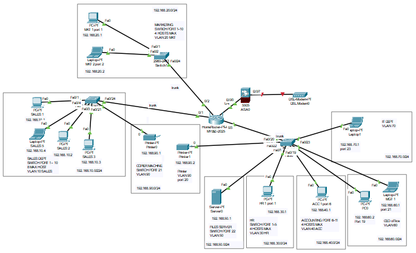

# small-business-network
In this lab, we are going to set up a template of a typical small business network.

Draft notes:
   1. The business (Noit Resources) will have a mix of wired desktops, printer/copy machine, a file server and laptops (wired).
   2. They will use a router, firewall and switches.
   3. The office network will be segregated into several VLANs for each department.
   4. The departments in the network & VLAN assignment below
      
| Department / Allocation | VLAN ID | Network Address | Subnet Mask | Gateway (Router Interface) |
| :--- | :---: | :--- | :--- | :--- |
| **Sales** | 10 | 192.168.10.0/24 | 255.255.255.0 | 192.168.10.1 |
| **Marketing** | 20 | 192.168.20.0/24 | 255.255.255.0 | 192.168.20.1 |
| **Human Resource** | 30 | 192.168.30.0/24 | 255.255.255.0 | 192.168.30.1 |
| **Accounts** | 40 | 192.168.40.0/24 | 255.255.255.0 | 192.168.40.1 |
| **Server** | 50 | 192.168.50.0/24 | 255.255.255.0 | 192.168.50.1 |
| **CEO's office** | 60 | 192.168.40.0/24 | 255.255.255.0 | 192.168.40.1 |
| **IT Management** | 70 | 192.168.70.0/24 | 255.255.255.0 | 192.168.70.1 |
| **IOT** | 90 | 192.168.90.0/24 | 255.255.255.0 | 192.168.90.1 |
   5.
   6. 
   7. Security:
      1.   All unused ports are disabled/secured
      2.   All open ports are tied to device MAC address
   8.Configuration
      1. Router
         1. Secure router
         2. VLAN set up
         3. ACL/routing
         4. Port configuration (trunk/access)
      2. Set up individual devices (PC, printers)
      3. Allow employee to remote access own workstations at office? - Under discussion
      4. Firewall setup
   
   8. Network Topology
   
   

Staff documentation
   1. Procedures - system info, login, procedures
   2. 
Future upgrade
1. electronic attendance
2. CCTV
3. Cloud
